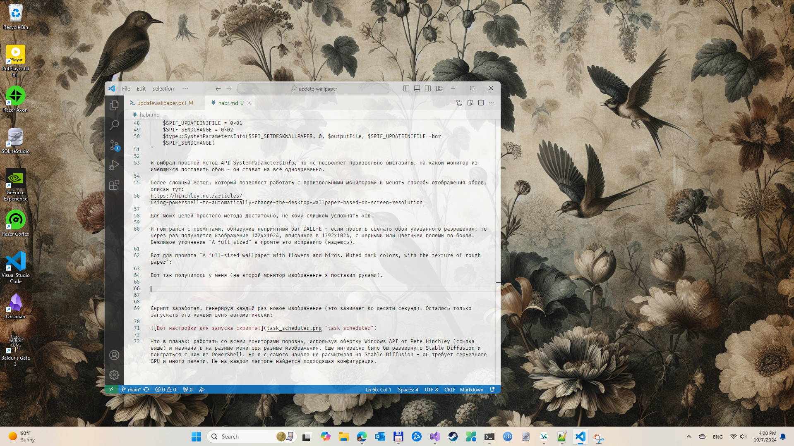
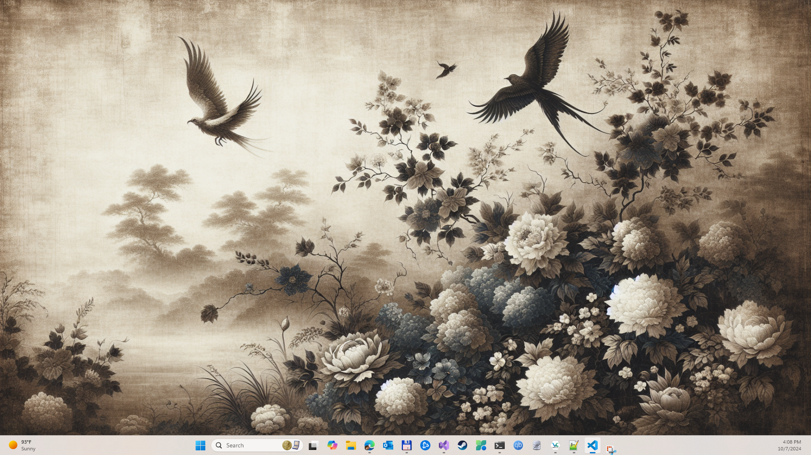
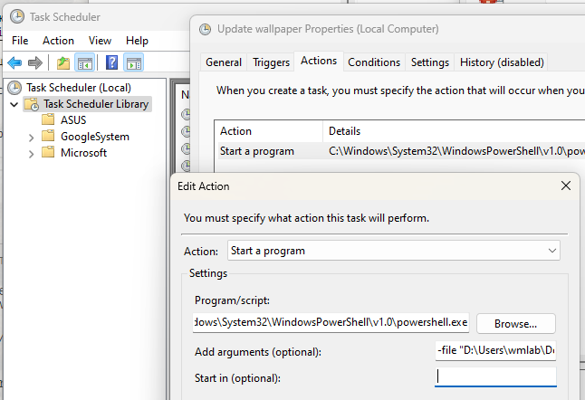

Прочитав свежую статью про обои в разных окружениях, начиная с Microsoft Windows 11 и методах их смены, я заинтересовался — нет ли скринсейвера, который может выставлять не готовые обои из папки или подкачивать из ресурса, а создавать переодически, используя любой доступный AI сервис. 

Гугление ничего не дало. С ходу я не нашел ни одного скринсейвера, который бы создавал обои от любого AI сервиса на лету. В сущности, это очень простая операция — почему бы не набросать свой скрипт в свободный день?

Я уже писал плагин для VSCode для проверки правописания и переводов русский-английский, так что OpenAI ключ у меня есть. Будем пробовать DALL-E 3, к которому этот ключ подходит. На реддите упоминали , что DALL-E умеет создавать бесшовные тайлованные изображения, что будет здорово для генерации обоев. Это впоследствии не подтвердилось, как я ни старался. Так что окончательный вариант работает с полным форматом изображения.

Самым простым вариантом мне показалось написать PowerShell скрипт и посадить его на расписание (task scheduler), чтобы он запускался сам каждый день и менял обои.

Отправной точкой является документ, описывающий современный [API DALL-E 3](https://platform.openai.com/docs/guides/images/usage).

Вот, собсвенно, и весь код получения изображения от DALL-E на PowerShell:
`
    $body = @{
        "model" = "dall-e-3"
        "prompt" = $prompt
        "n" = 1
        "size" = "1792x1024"
    } | ConvertTo-Json

    $response = Invoke-RestMethod -Uri "https://api.openai.com/v1/images/generations" ``
        -Method Post ``
        -Headers @{ "Authorization" = "Bearer $apiKey"; "Content-Type" = "application/json" } ``
        -Body $body

    $imageUrl = $response.data[0].url
`

В переменную `$prompt` мы положим наш промпт, а разрешение 1792x1024 я подобрал опытным путем. Если вызывать API с произвольным разрешением, то возвращается ошибка с указанием всех дозволенных разрешений. Я выбрал максимально доступное.

Хорошей идеей является не перезаписывать предыдущее полученное изображение, а создавать новое, со случайным именем. Во-первых, через некоторое время у нас появятся «любимчики», а во-вторых можно будет на разные мониторы назначать разные обои из уже имеющихся.

`
    $chars = "abcdefghijklmnopqrstuvwxyz0123456789"
    $randomString = -Join ((1..8) | ForEach-Object { $chars[(Get-Random -Maximum $chars.Length)] })
    $outputFile = "$outputDir\dalle_generated_$randomString.jpg"
`

Ну, и осталось полученное изображение установить на десктоп:

`
    $code = @"
    [DllImport("user32.dll", CharSet = CharSet.Auto)]
    public static extern int SystemParametersInfo(int uAction, int uParam, string lpvParam, int fuWinIni);
    "@
    $type = Add-Type -MemberDefinition $code -Name "Wallpaper" -Namespace "Win32" -PassThru
    $SPI_SETDESKWALLPAPER = 0x0014
    $SPIF_UPDATEINIFILE = 0x01
    $SPIF_SENDCHANGE = 0x02
    $type::SystemParametersInfo($SPI_SETDESKWALLPAPER, 0, $outputFile, $SPIF_UPDATEINIFILE -bor $SPIF_SENDCHANGE)
`

Я выбрал простой метод API `SystemParametersInfo`, но он не позволяет произвольно выставить, на какой монитор из имеющихся поставить обои — он ставит на все одновременно.

Более сложный метод, который позволяет работать с произвольными мониторами и менять способы отображения обоев, описан [у Pete Hinchley](https://hinchley.net/articles/using-powershell-to-automatically-change-the-desktop-wallpaper-based-on-screen-resolution).

Для моих целей простого метода достаточно, не хочу слишком усложнять код.

Я поигрался с промптами, обнаружив неприятный баг DALL-E — если просить сделать обои указанного разрешения, то через раз получается изображение 1024x1024, вписанное в 1792x1024, с черными или цветными полями по бокам. Вежливое уточнение "A full-sized" в промте это исправило. Надеюсь, что исправило.

Мой промпт — вкусовщина. Люблю старомодные обои с низким контрастом. "A full-sized wallpaper with flowers and birds. Muted dark colors, with the texture of rough paper".

Вот так получилось у меня (на второй монитор изображение из предыдущих попыток я поставил вручную). 

Скрипт заработал, генерируя каждый раз новое изображение (это занимает до десяти секунд). Осталось только запускать его каждый день автоматически:

Вот ссылка на [гитхаб](https://github.com/wmlabtx/update_wallpaper/blob/main/updatewallpaper.ps1) с исходником скрипта.

Что в планах: работать со всеми мониторами независимо, используя обертку Windows API от Pete Hinchley (ссылка выше) и назначать на разные мониторы разные изображения автоматически. Еще надо в свободный день развернуть Stable Diffusion и поиграться с ним из PowerShell. Но я с самого начала не расчитывал на Stable Diffusion — он требует серьезного GPU и много памяти. Предвижу много возни с настройкой, да и не на каждом десктопе или лаптопе найдется подходящая конфигурация. Но было бы интересно попробовать.